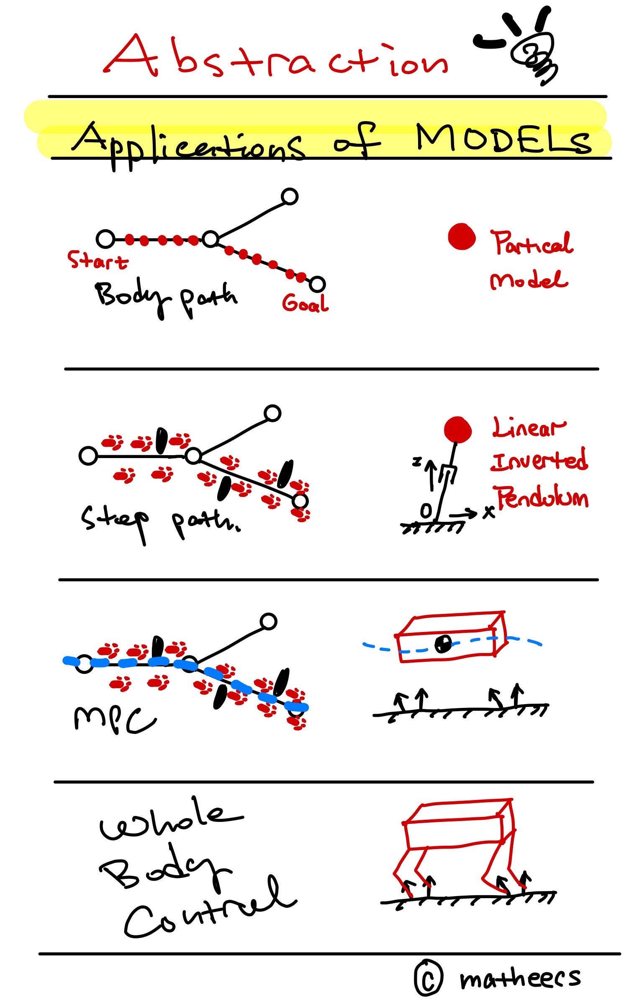

### TODO

- [ ] 下楼梯显示异常
- [ ] 有时无法检测出楼梯
- [ ] RViz 显示结果有误
- [ ] RViz 显示点云会导致 stair_modeing 暂停⏸️ 推测是 message_filters 导致的问题
  - [ ] 考虑合并为一个节点
  - [ ] 相机点云降采样再发布
- [ ] 面特征 vs 线特征 from depth images
- [ ] 噪声

### Package lists

| name                   | function                         |
| ---------------------- | -------------------------------- |
| LIP_demo               | LIP结合Capture Point做落脚点规划 |
| **local_grid**         | 局部地图                         |
| peac_ros               | 平面检测                         |
| plane_msg              | 平面消息                         |
| realsense-ros          | 相机驱动                         |
| stair_info_msg         | 楼梯消息                         |
| stair_modeling         | 楼梯建模                         |
| **stair_modeling_ros** | 平面检测结合楼梯建模             |

### Stairs Modeling

  

### Control Framework

  

