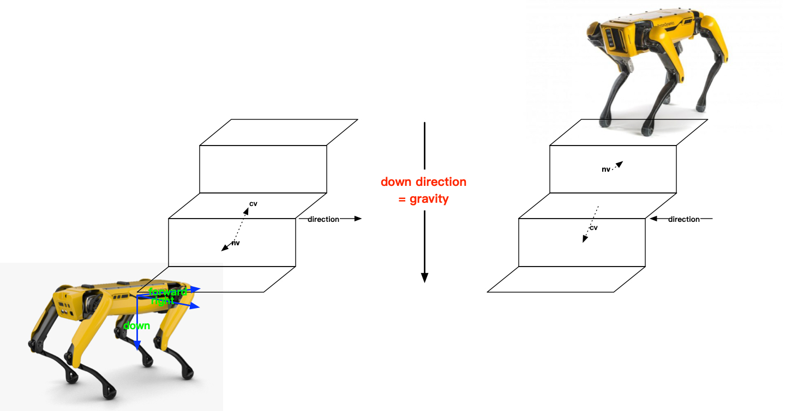

### TODO

- [ ] 下楼梯显示异常
- [ ] 有时无法检测出楼梯
- [ ] RViz 显示结果有误
- [ ] RViz 显示点云会导致 stair_modeing 暂停⏸️ 推测是 message_filters 导致的问题
  - [ ] 考虑合并为一个节点
  - [ ] 相机点云降采样再发布
- [ ] 面特征 vs 线特征 from depth images
- [ ] 噪声